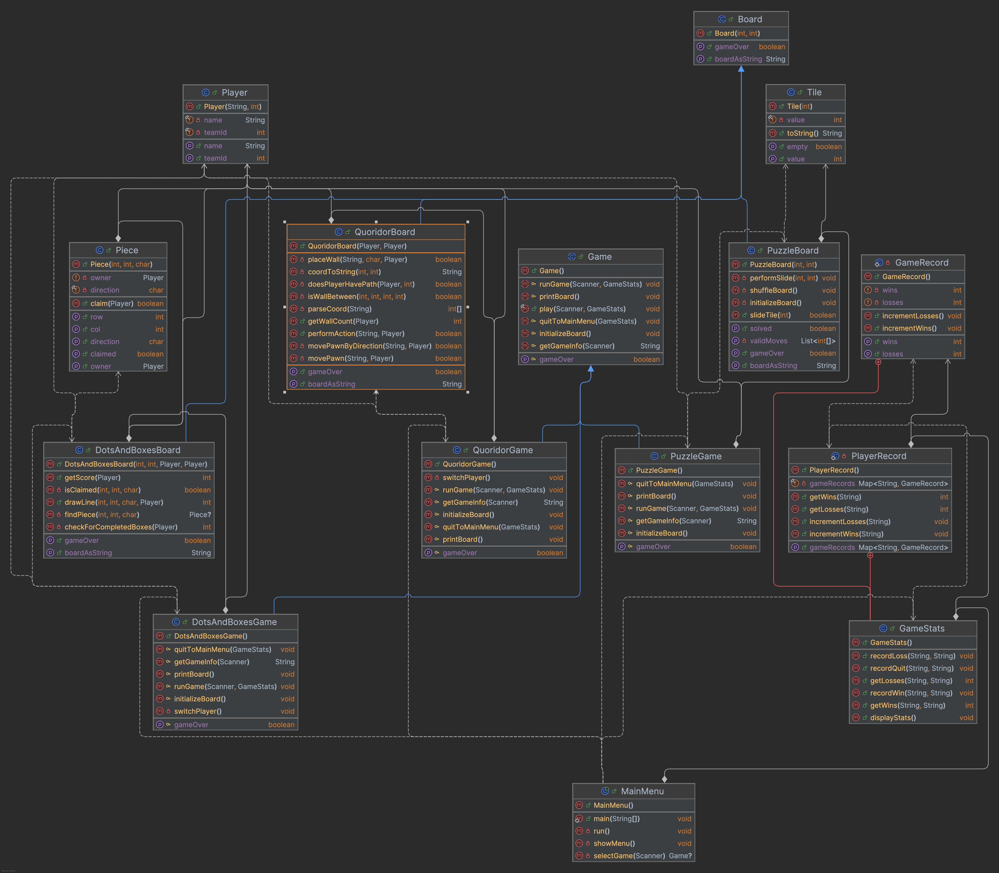

# Board Game Suite: Design Documentation

This document details the design philosophy, class structure, and architectural patterns employed in building this extensible board game application. The core objective of the design is to establish a robust and reusable framework, simplifying the integration of new games.

---

## 1. Class Structure & UML

The application's architecture is founded on key Object-Oriented principles, primarily:

1.  **Template Method Pattern:** Utilized in the abstract `Game` class, which defines a standard game lifecycle (`play()` method). Concrete game classes (`DotsAndBoxesGame`, `PuzzleGame`, `QuoridorGame`) implement specific steps (`getGameInfo`, `initializeBoard`, `runGame`, etc.) within this fixed structure.
2.  **Separation of Concerns:** The design distinctly separates the game flow logic (Controller) from the game state and rules (Model).
    * **Controller (`Game` subclasses):** Manage the overall game loop, handle user input, track turns, and interact with the Model.
    * **Model (`Board` subclasses):** Encapsulate the game's internal state (board layout, piece positions, scores, walls), enforce game rules, and provide methods to modify the state (`slideTile`, `drawLine`, `performAction`).

### Core Components:

* `MainMenu`: Serves as the application's entry point and acts as a factory, presenting a menu to the user and instantiating the chosen `Game` object.
* `Game`: Abstract base class defining the common structure and lifecycle for all games using the Template Method pattern.
* `Board`: Abstract base class defining fundamental board properties (width, height) and required methods (`getBoardAsString`, `isGameOver`) for all game board implementations.
* `Player`: Represents a player, storing their `name` and `teamId`, used across different games.
* `Piece` / `Tile`: Helper classes representing game-specific elements (`Piece` for Dots and Boxes lines, `Tile` for Puzzle squares).

### UML Diagram:

The UML diagram visually represents the relationships described above, showcasing the inheritance from `Game` and `Board`, and the composition relationship where each `Game` instance *has a* corresponding `Board` instance. The addition of `QuoridorGame` and `QuoridorBoard` follows this established pattern precisely.

---

## 2. Scalability and Extendibility

The framework is designed explicitly for extendibility. Adding a new board game involves a straightforward, standardized process:

1.  **Create a Model Class:** Implement a new class (e.g., `NewGameBoard.java`) that extends `Board`. This class encapsulates all rules, data structures, and state logic specific to the new game.
2.  **Create a Controller Class:** Implement a new class (e.g., `NewGame.java`) that extends `Game`. This class handles user interaction, game setup, and orchestrates the game flow by calling methods on its corresponding `NewGameBoard` instance.
3.  **Update `MainMenu`:** Add a new menu option and a `case` statement in the `selectGame` method within `MainMenu.java` to create an instance of `NewGame`.

This design adheres to the **Open/Closed Principle**: the core framework (`Game`, `Board`, `MainMenu`) is closed for modification but open for extension. New games can be added without altering the existing, tested framework code, ensuring stability and promoting scalability. The successful integration of the Quoridor game serves as a practical validation of this design's extendibility.

---

## 3. Framework Selection & Changes

### Framework Selection Rationale:

The abstract `Game` and `Board` classes were chosen as the foundational framework for several reasons:

* **Consistency:** The `Game` class's Template Method ensures all games share a predictable lifecycle and user interaction pattern (setup -> play -> cleanup).
* **Encapsulation:** The `Board` subclasses encapsulate complex game logic, hiding implementation details from the `Game` controllers. This makes the code modular and easier to maintain (e.g., `QuoridorGame` doesn't need to know *how* `QuoridorBoard` checks for path blocking).
* **Polymorphism:** `MainMenu` can treat all game objects (`PuzzleGame`, `DotsAndBoxesGame`, `QuoridorGame`) simply as `Game` instances, calling the common `play()` method without needing to know the specific type.
* **Reusability:** Common elements like `Player` are reused across different games.

### Changes Since Prior Submission:

Significant enhancements and refinements were made based on feedback and project evolution:

1.  **Quoridor Game Addition:** Successfully extended the framework by implementing the Quoridor game, adding `QuoridorGame.java` and `QuoridorBoard.java` following the established design pattern.
2.  **Player Class Enhancement:** Refactored the `Player` class to include a `teamId` attribute, improving user feedback during gameplay by displaying team information.
3.  **MainMenu Update:** Modified `MainMenu.java` to incorporate Quoridor as a playable option.
4.  **`PuzzleBoard` Refactoring:** Updated `PuzzleBoard.java` to correctly utilize the `Tile` class for representing board squares, addressing previous feedback and improving object-oriented design. The `README.md` was also updated to reflect this change.
5.  **Game Statistics:** Added the `GameStats` class and integrated statistic recording and display features into the application flow via `MainMenu`.